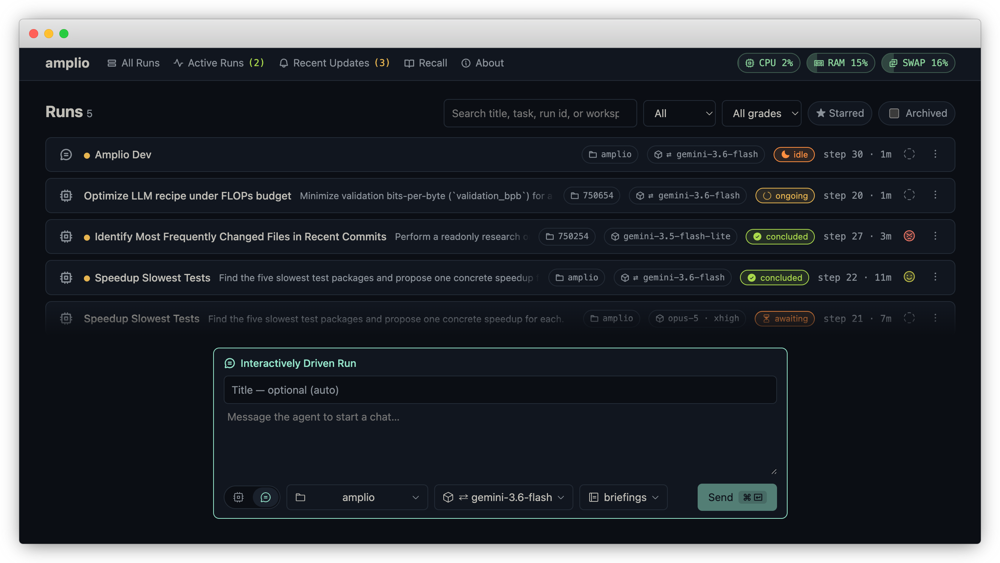
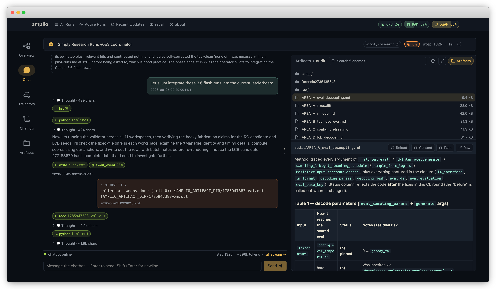

# Runs

A **run** is one unit of work with its own task, workspace, model and history.
Inside it, an **agent session** is one conversation with the model: the run's
root session, plus a session for every sub-agent it spawns.

A run is a soft isolation of a work: agent sessions can coordinate with each
other within a run: communication via messaging, coordination via shared artifact
dir, and collaboration via linked VCS (isolated edits but shared commit log), etc.

The front page of Amplio web UI show a list of existing runs. The runs list 
can be filtered according to status (Active / Updates / etc.), grades (human
or auto-critic assigned), star / archive, etc. or searched. A new run can be
started by interacting with the prompt field at the bottom, which will expand
to the "New Run" form upon focus.

## Interactive run and autonomous run

Amplio support two modes of runs:

**Interactive.** The most typical mode used by common agentic coding harnesses: 
you interact with a chatbot agent that can make tool calls. You drive the work
through the interaction with the chatbot.

**Autonomous.** You give a task; a `main-agent` works until it is finished. An auto-critic will review the run and generate a report. You review the results and report, send follow up requests to start a new iteration if needed.

The different modes impact the behaviors of some internal mechanism (e.g. how and
when the run level auto-critic is triggered), but they are not completely separated.
Under the hood: for autonomous runs, one can still activate the chatbot, which can
bridge the user and the autonomous agent to check the progress, analyze the trajectory,
or steer the run mid-execution; on the other hand, in an interactive run,
the chatbot can spawn sub-agents to autonomously work on long horizon tasks.

## What you see while it runs

There are several views of a run: 

- **Overview** shows the overall meta information of the run, the model, workspace,
  the task, the auto-critic report, the sub-agent session tree, etc.
- **Chat** is the UI for interacting with the chatbot.
- **Trajectory** and **Chat log** are viewer of the execution trajectories of all
  the agent sessions of this run. They are different display of the same data.
- **Artifacts** is a viewer of the artifacts (plan, todo, reports, etc.) generated
  by the agents for this run (a mini artifacts viewer can be open in the sidebar of
  the **Chat** page as well).

Amplio uses background observers to summarize and break the agent trajectories into
phases, making it easier for operators to review the trajectories, and for the
auto-critic agent to grade the run.

## Sessions, sub-agents and status

A session is `ongoing` while working, `awaiting` while blocked on something,
`idle` when parked for input, and ends `concluded`, `crashed` or `cancelled`.

An agent can spawn sub-agents for focused work — a survey, a build, a review —
each with its own session, its own context, and its own history in the same run.
A sub-agent's result comes back to its parent as a message; the parent decides
what to do with it.

If the server stops while a run is working, the run resumes on the next start:
amplio revives the sessions that were still active. A crashed run can also be
revived on demand from the UI or with `amplio client restart`.

Amplio is designed to be robust to resume from crashes that can occur any time during execution while keeping the agent session tree consistent. Amplio does not make proactive decision on two questions:

- Whether to auto re-run failed tool call: Amplio report failures / crashes to the agent and let the agent decide the best next step.
- Whether to auto resume crashed run: Amplio leave the decision to the user whether or when to resume, depending on the crash reasons.

## Artifacts

Every run gets a directory of its own, created with the run, exported to the
agent as `$AMPLIO_ARTIFACT_DIR`. It is the right place for anything the agent
produces that is not source code: a generated report, a plot, a scratch script,
intermediate data.

## Reports

When an autonomous run's main agent concludes, a **report** is generated by a
critic — a separate agent, using the HQ system model, that reads the run's
history and writes an assessment. It contains:

| field | what it holds |
|---|---|
| summary | what the iteration did, in prose |
| grade | the critic's verdict (see below) |
| key achievements | claims, each cited to the steps that support them |
| failure modes | what went wrong, likewise cited |
| struggles | places the agent got stuck, and for how long |
| artifacts | files, commands, metrics and identifiers worth checking |
| phases | the run's arc, from the phase summaries |

Reports are **per iteration**: after reading the report, the operator can
send follow up to prompt the agent to push the work further. Each time a
new iteration concludes, a new report will be generated.

Interactive runs get no automatic report — there is no conclusion to trigger it
— but you can manually trigger the generation from the run page.

### Grades

The critic grades each iteration on a five-point scale:

    garbage · bad · meh · good · excellent

You can override it. A human grade takes precedence over the critic's and is
what the run list shows.

## Ending a run

`cancel` stops a run and cascades to every session under it. Cancellation is a
request: it returns once accepted, not once every agent has stopped.

Archiving takes a run out of your default list without deleting anything, which
is the reversible way to keep the dashboard readable. Deleting removes the run's
database rows and its artifact and blob directories, and cannot be undone;
lessons mined from it survive, because they are corpus rather than run data.
